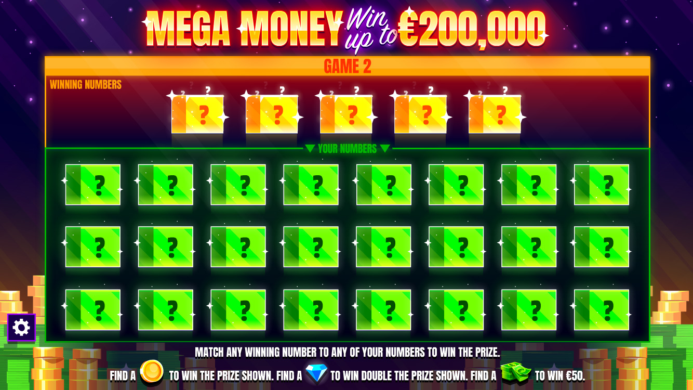
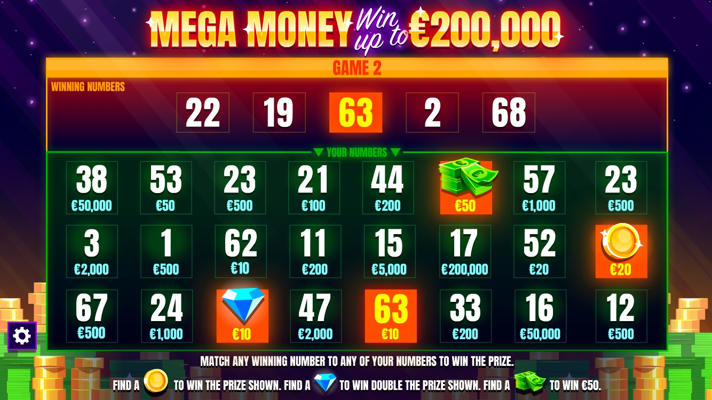

# Instant Win Games Assignment

## Overview

The purpose of this assignment is to assess your experience with building HTML5 games and animations. It is also a great opportunity for you to have a glimpse of the actual work that you would do as a member of our team, since the game you are about to build closely resembles the ones that we build daily for our customers.

This assignment focuses on the front-end side and has no integration with the server-side. All assets needed for the assignment are available in the `src/assets` folder. Expected result of the assignment is shown with several videos in the **Deliverables** section below.

The structure of this project is a simplified version of our game template and represents in full the technology stack we use for our projects. This way you will have a chance to get familiar with the tools we use to develop games, and we will get a better sense of how easily you can adjust to our way of doing things.

Please note that you do not need to cover all the requirements and build the game in full, but you should at least implement the minimum requirements listed below. You can also add any other unlisted features or animations that you think will demonstrate your skills. Generally, we expect more senior candidates to complete as many optional requirements as possible.

## Game Description

The screen is split in two areas – one that contains the **winning numbers**, and the second that contains the **player's numbers**:

The player can click on any of the boxes in the "Winning numbers" or "Your numbers" sections to reveal the numbers underneath.

**If there is a match between any winning number to any player's number, the player wins the prize shown on that particular player box** (see number 63 in the image below). Furthermore, if the player reveals a coin icon, they are immediately awarded the prize shown, without the need for a match with a winning number. Same goes if the player reveals diamond icon, but the prize shown gets doubled. Finally, if the player reveals a "stack of money" icon, they are immediately awarded 50 euros.

Player should be able to click on any of the boxes displayed on the screen in any desired sequence, and if there is a match (or multiple matches) or a special icon revealed, an appropriate prize should be awarded, and winning animation showed immediately.

The final prize will be the sum of all amounts that the player has been awarded (if any). At the end of the game, after revealing all the boxes, the screen should look something like this:

## Deliverables

We use [PixiJS](https://pixijs.com/) for rendering, [GSAP](https://greensock.com/gsap/) for animations, [Webpack](https://webpack.js.org/) for development and builds, [NPM](https://www.npmjs.com/) for dependency management, and we write JavaScript with ES6 modules. We expect you to do the same for this assignment.

Completed assignment should be committed to this repository, where our team will review and assess it by the agreed deadline. You are welcome to make changes to the repo at any pace that suits you best, with multiple small commits or few more elaborate ones – either way is fine, we want to get to know what is the most comfortable way for you to work.

Videos below show how game is expected to look and behave for different outcomes:

### Win gameplay sequence 📺

https://user-images.githubusercontent.com/106312738/179737992-9a40775f-abab-46f1-87d9-2c45168f8aad.mp4

### Lose gameplay sequence 📺

https://user-images.githubusercontent.com/106312738/179738638-43afe14a-5329-4ed7-b0c3-a9286376f116.mp4

## Minimum requirements

* Arrange the provided assets to resemble the first screen shown in **Game Description** section above.

* The little star icons (`sparkle.png`) at the edges of the boxes rotate infinitely, in opposing directions (i.e., the one at the left rotates counterclockwise and the one at the right rotates clockwise).

* When the player hovers any box, it shows a simple animation using particle images (`particle.png` and `particle-2.png`). The animation shows several such particles being emitted upwards and then fade away. The box also becomes larger on hover.

* When the player clicks on a box, it reveals (randomly) one of the following:
  * a randomly selected integer in the range of 1 to 100, inclusively,
  * a stack of money (`symbol-1.png`),
  * a coin icon (`symbol-2.png`),
  * a diamond icon (`symbol-3.png`),
  
  with a prize amount underneath which can be one of the following:

  [10, 100, 1000, 10000, 100000].

* When a winning symbol is revealed, the corresponding player number boxes are painted orange.

* A glow animation is played on the corresponding number boxes when a winning symbol is revealed (using assets under the `shimmer-png-sequences` subfolder).

## Additional Requirements

* At the end of a winning game an animation is played with coins falling from the top (using assets under the `coin-png-sequence` subfolder), and the total amount won is displayed.

* At the end of a losing game an overlay with a "Better luck next time" message is displayed.

* When the game loses focus (e.g., the player switches to another tab in the browser), an overlay is displayed, and all animations are paused.

* After some time of inactivity from the player, the game should display some *Call To Action* animation – for example move or add a glow to some boxes to draw the player's attention.

**If any of the requirements are unclear or contain conflicting information, please make a reasonable assumption and act accordingly.*

## Project scripts

#### `npm run serve`

Runs the webpack dev server with development configuration, source maps, and live reloading. Opens the game automatically in the browser when run. Very useful for rapid development.

#### `npm run build:dev`

Runs `prebuild` script followed by webpack build command with development configuration.
Development build is output in `dist` folder.

#### `npm run build:prod`

Runs `prebuild` script followed by webpack build command with production configuration.
Production build is output in `dist` folder.

#### `npm run clean`

Deletes `dist` folder with all of its contents.

#### `npm run lint`

Enforces eslint formatting on all `.js` source files.

#### `npm run prebuild`

Convenient script which runs `clean` and `lint` scripts sequentially.

